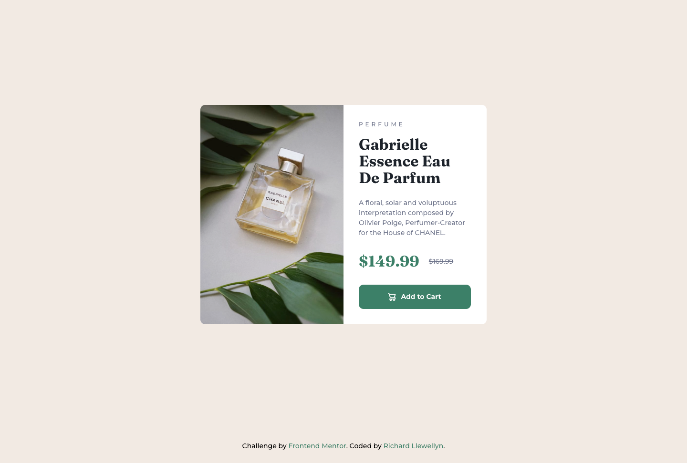

# Frontend Mentor - Product preview card component

This is a solution to the [Product preview card component challenge on Frontend Mentor](https://www.frontendmentor.io/challenges/product-preview-card-component-GO7UmttRfa). Frontend Mentor challenges help you improve your coding skills by building realistic projects. 

## Table of contents

- [Overview](#overview)
  - [The challenge](#the-challenge)
  - [Screenshot](#screenshot)
  - [Links](#links)
- [My process](#my-process)
  - [Built with](#built-with)
  - [What I learned](#what-i-learned)
- [Author](#author)

## Overview

### The challenge

Users should be able to:

- View the optimal layout depending on their device's screen size
- See hover and focus states for interactive elements

### Screenshot

### Links

- Solution URL: [https://www.frontendmentor.io/solutions/responsive-product-preview-card-with-flexbox-AGHg-7_Xmq](https://www.frontendmentor.io/solutions/responsive-product-preview-card-with-flexbox-AGHg-7_Xmq)
- Live Site URL: [https://richllew182.github.io/product-preview-card/](https://richllew182.github.io/product-preview-card/)

## My process

### Built with

- Semantic HTML5 markup
- CSS custom properties
- Flexbox

### What I learned

Experimenting more with css variables and utility classes, helps to speed up the process and reduce the css file size.

## Author

- Website - [Richard Llewellyn - Front End Developer Portfolio](https://richllew.dev/)
- Frontend Mentor - [@RichLlew182](https://www.frontendmentor.io/profile/RichLlew182)
